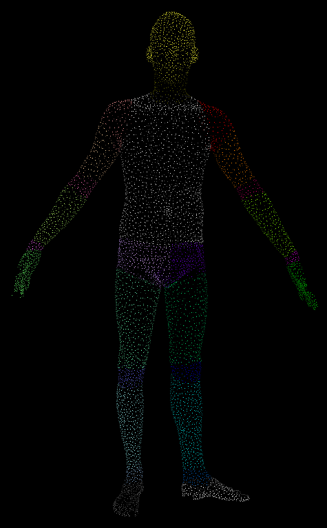

# Point Cloud Annotation for machine learning
This repo provides the PCD annotation guideline of 3D human models \
It includes the processing algorithm of annotation files for machine learning

## Annotation tool
This repo is using [Semantic Segmentation Editor](https://github.com/Hitachi-Automotive-And-Industry-Lab/semantic-segmentation-editor.git) as labeling tool. \
It support .pcd file as input and output .txt file as annotation.

## Configuration of Semantic Segmentation Editor
1. Follow the [original page](https://github.com/Hitachi-Automotive-And-Industry-Lab/semantic-segmentation-editor.git) to install the Semantic Segmentation Editor
2. Access to semantic-segmentation-editor-master
3. Put all the input .pcd files in "img_folder"
4. Replace the original settings.json with our [settings.json](./settings.json)
5. You are ready to annotate the point cloud

## Getting Started with our post-processing algorithm
Use the pip to install dependencies, you may use conda instead

```bash
pip install numpy
pip install pymeshlab
pip install open3d
pip install pandas
```

## Transform the mesh from .obj to .pcd
If your data is saved with .obj format, you may use [obj_to_pcd.py](./obj_to_pcd.py) to convert the meshes into .pcd format \
To convert the meshes, please create the directories as following:

```bash
├── input_obj
│   ├── 1_139.obj
│   ├── 1_141.obj
├── output_pcd
└── obj_to_pcd.py.py
```

## Mesh simplification
If there are too many vertices in the input meshes, you may use [mesh_reduce.py](./mesh_reduce.py) to reduce the vertices into 10000 vertices

## Annotation post-processing for machine learning
To convert the annotation txt file, please create the directories as below and run [annotation_output.py](./annotation_output.py):

```bash
├── input_obj
│   ├── a.obj
│   ├── b.obj
├── input_annotated_txt
│   ├── a.txt
│   ├── b.txt
├── output_txt
├── ply_without_color
├── ply_with_color
├── apply_color_to_ply.py
└── annotation_output.py
```

The .ply with RGB color files are stored in "ply_with_color" folder \
It will be saved in ascii format with following properties:
```bash
x y z red green blue
```

The simplified .txt annotation files are stored in "output_txt" folder \
It will be saved as x y z label format:
```bash
x y z label
```
## .ply file with RGB value
The result ply will be look like this:

You may add/remove body parts and change the color in [settings.json](./settings.json)

## Invisible spaces in .ply file
For each ply file generated, there maybe some spaces randomly generated by the library. It may cause the ply file cannot be read. \
To remove the spaces, please run following code with terminal inside the folder:
```bash
sed -i 's/[ \t]*$//' *.ply
```

